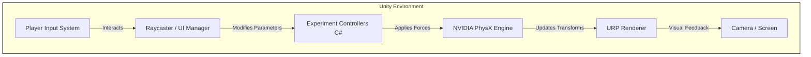

# Virtual Mechanics Lab - TNTU 


An interactive 3D physics laboratory designed to simulate classical mechanics experiments. Developed as a virtual simulation platform for Ternopil National Technical University (TNTU), providing students with hands-on, high-precision experimental setups in a fully 3D environment.

---

## 💡 Why This Project Matters

This project bridges the gap between theoretical physics and practical observation by moving beyond static textbooks. It highlights:

* **Real-Time Physics Simulation:** Utilizing Unity's core physics engine to accurately calculate RigidBody interactions, friction, mass, and gravity.
* **Interactive Learning:** Allowing users to manipulate experimental variables dynamically and observe immediate physical consequences.
* **Optimized Rendering:** Built using the Universal Render Pipeline (URP) to ensure smooth performance across various hardware setups, from high-end PCs to standard student laptops.
* **Modular Architecture:** Designed with component-based logic, making it easy to add new laboratory setups or experimental instruments without breaking existing functionality.

---

## 🏗 System Architecture & Flow

The project relies on strict separation between the simulation logic, physical calculations, and user input interfaces.



### 🧩 Core Mechanics

1. **Initialization:** The environment loads the specific laboratory scene (e.g., Pendulum, Spring Oscillator).
2. **Setup:** The user adjusts initial parameters (mass, string length, angle) via the UI canvas.
3. **Execution:** Custom C# controllers translate these inputs into exact physical properties applied to the 3D meshes.
4. **Observation:** The PhysX engine calculates the collisions, constraints, and velocities frame-by-frame, providing real-time data visualization.

---

## 🔬 Technical Highlights

* **FBX Workflows:** Clean geometry imports specifically optimized for game engines, ensuring accurate hitboxes and colliders.
* **Input System:** Modern Unity Input System implementation for flexible cross-platform controls.
* **Prefab Variants:** Extensive use of nested prefabs for laboratory instruments (voltmeters, rulers, stands) to maintain consistency across different scenes.
* **Clean Scripting:** C# scripts strictly adhere to OOP principles, avoiding monolithic `Update()` loops in favor of event-driven physics calculations.

---

## 🛠 Tech Stack

| Category | Technology | Usage |
| --- | --- | --- |
| **Engine** | **Unity 6** | Core runtime and scene management. |
| **Language** | **C#** | Scripting logic and experiment controllers. |
| **Rendering** | **URP** | Universal Render Pipeline for optimized graphics. |
| **Physics** | **Built-in 3D PhysX** | Collision detection and rigid body dynamics. |
| **3D Assets** | **FBX / Blender** | Custom modeled laboratory equipment and props. |
| **Version Control**| **Git & GitHub** | With strict Unity-specific `.gitignore` rules. |

---

## 🚀 Getting Started

### Prerequisites

* [Unity Hub](https://unity.com/download)
* Unity Editor Version **6000.0.x** (or the specific version used in the project)
* Git

### 1. Clone the Repository

```bash
git clone https://github.com/oket23/Virtual_Mechanics_TNTU.git
```

### 2. Open in Unity

1. Launch **Unity Hub**.
2. Click **Add** -> **Add project from disk**.
3. Select the cloned `virtual-mechanics-tntu` folder.
4. Wait for the engine to generate the `Library` folder and import all assets.

### 3. Explore the Labs

Navigate to `Assets/Scenes/` in the Project window. Open the `SampleScene.unity` or any specific `Lab_XX.unity` scene and press the **Play** button at the top to start the simulation.

---

## 📂 Project Structure

The repository follows a clean, easily navigable structure:

```text
Assets/
├── Labs/                 # Specific folders for each experiment (Models, Textures)
│   ├── Lab_2/
│   ├── Lab_10/
│   └── Lab_14/
├── Materials/            # Shared materials and shaders
├── Scenes/               # Unity scene files for different labs
├── Settings/             # URP profiles and input configurations
├── Stendy/               # Posters, informational boards, and reference images
└── Table/                # Core environment assets (desks, room structures)
```

## ⚖️ Limitations & Future Work

* **Precision Trade-offs:** Fixed timestep updates (`FixedUpdate`) are optimized for visual realism but may have minute floating-point deviations over extended periods compared to pure mathematical formulas.
* **Roadmap:** Implementation of data-export functionality (e.g., saving experiment results to `.csv`).
